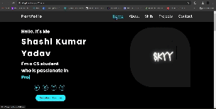

# Portfolio< Repository
This repository contains Portfolio that were developed to help developers learn and improve their skills in web development. Each project has its own folder and contains all the necessary files, including HTML,CSS,JS.

# Project
<a href="https://skyy4.netlify.app/">Portfolio</a>
 

# Installation
To use these projects, simply clone or download the repository to your local machine:

git clone https://github.com/skyy4/CODSOFT/tree/main/t2_portfolio

  
# Usage
Each project is contained within its own folder. To view the project, simply open the index.html file in your web browser. The files are also included within the project folder.
# Contributing
If you would like to contribute to this repository, feel free to submit a pull request or open an issue. We welcome contributions from the community to make these projects even better! 